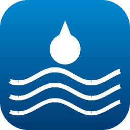
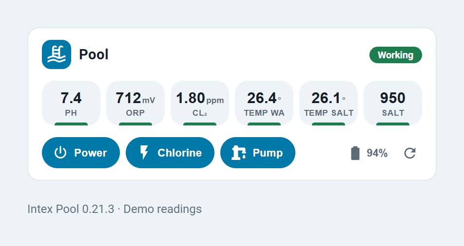
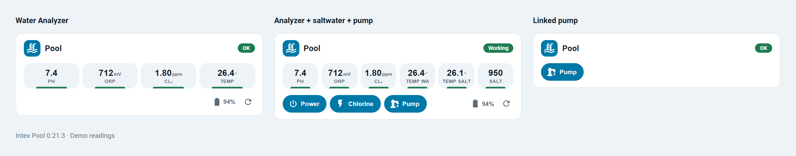
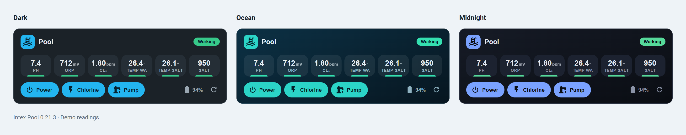

<div align="center">



# Intex Pool for Home Assistant

**A native Home Assistant integration + a compact, adaptive dashboard card for Intex / AGP (Tuya-based) pool equipment.**

Water-quality sensor · saltwater system · any-brand sand-filter pump — set up from the UI, no MQTT, no YAML.

[](https://github.com/hacs/integration)
[](https://github.com/Hovborg/intex-pool/releases)
[](https://github.com/Hovborg/intex-pool/actions/workflows/validate.yaml)
[](https://github.com/Hovborg/intex-pool/actions/workflows/hassfest.yaml)
[](LICENSE)

<picture>
  <source media="(prefers-color-scheme: dark)" srcset="docs/images/card-dark.png" />
  
</picture>

<br/>

[](https://my.home-assistant.io/redirect/hacs_repository/?owner=Hovborg&repository=intex-pool&category=integration)

</div>

---

## ✨ Why this exists

Home Assistant's official Tuya integration maps these `rs`-category pool devices to empty
`climate` shells; LocalTuya / tuya-local have no working profile; and the water sensor is
cloud-only. **Intex Pool** talks to each device the way that actually works and gives you
clean, named entities — plus a card that looks good out of the box.

## 🧩 Supported equipment

Pick **any combination** — one, two, or all three:

| | Device | Connection | What you get |
|---|---|---|---|
| 💧 | **Water quality sensor** (AGP Smart Sensor / Water Analyzer) | Tuya cloud | pH, ORP, free chlorine, temp, battery · writable pH/ORP targets · refresh button |
| 🧂 | **Saltwater system** (Intex/AGP QS-series) | Local LAN | Power & chlorine switches, salinity, water temp, self-clean & temp-unit selects, decoded status/alarm/error |
| 🌀 | **Sand-filter pump** | Local Tuya **or any HA switch** | On/off + (when linked) power / energy |

> 🔌 **Any brand of pump works.** Not a Tuya device? Link any existing HA switch (Shelly,
> Zigbee relay, …) and it joins the pool card alongside the Intex gear.

## 📸 The card adapts to what you have

It shows only the sections for the equipment you own — chemistry-only, full, or pump-only:

<div align="center">

</div>

The card is served **by the integration itself** — no separate HACS plugin to install. Add it
from the card picker as **“Intex Pool”** and it auto-detects your entities.

## 🎨 Choose your look

A **`variant`** option lets you pick the style right in the card editor — `auto` (follows your
Home Assistant theme), `light`, `dark`, and two designed dark looks: **ocean** (teal gradient)
and **midnight** (deep indigo):

<div align="center">

</div>

```yaml
type: custom:intex-pool-card
variant: ocean   # auto | light | dark | ocean | midnight
```

## 🗓️ Schedules

The saltwater system's built-in schedules live only in the cloud as an encoded blob, so they're
normally invisible. This integration **decodes them**: a read-only **Schedules** sensor shows
how many are active and lists each (daily/one-time, time, duration, on/boost). Each slot also gets
its own **toggle**, **duration** and **start-time** entities under the device, so you can turn a
schedule on/off and retune it without the service call.

> **Slot 0 = Boost.** The first slot is the device's **Boost** cycle. It runs for a set number of
> hours rather than at a clock time (the app ignores a start time for it), so it's exposed as
> **Boost** + **Boost duration** only — no start-time entity. Turning **Boost on suspends your
> timed schedules** (they're remembered, then restored when Boost is turned off) — mirroring how
> the unit reverts to its normal schedule after a boost completes, and confirmed against the
> device's Tuya thing-model (`working_indicator` reports `boost`).

You can also **edit** any slot from HA with the **`intex_pool.set_schedule`** service (writes back via the cloud):

```yaml
service: intex_pool.set_schedule
data:
  slot: 4          # 0–6
  enable: true     # off behaves like the boost cycle
  hour: 22
  minute: 0
  duration: 2
  days: 255        # 255 = every day, 0 = one-time (then set month/date)
```

> Schedules need a configured water sensor (for the Tuya cloud credentials) + a saltwater system.
> The byte format round-trips exactly; the exact units of duration/days are best-effort.

## 🚀 Installation

[](https://my.home-assistant.io/redirect/hacs_repository/?owner=Hovborg&repository=intex-pool&category=integration)

1. Click the button above (or HACS → ⋮ → **Custom repositories** → `https://github.com/Hovborg/intex-pool`, category **Integration**).
2. Download **Intex Pool** in HACS and **restart Home Assistant**.
3. **Settings → Devices & Services → Add Integration → Intex Pool**.
4. Enter your Tuya cloud credentials and pick your devices (see below).

## ⚙️ Setup — the easy way (cloud auto-discovery)

You only need **Tuya IoT developer-cloud credentials** once: a free project at
[iot.tuya.com](https://iot.tuya.com) (region, Access ID, Access secret) with your Smart
Life / Tuya app account linked. Enter those and the integration will:

- 🔑 **fetch your devices and their local keys automatically** (no `tinytuya wizard`), and
- 📡 **scan your network for their IPs + protocol version automatically** (no IP typing).

Then just pick which discovered devices are your **saltwater system** and **water sensor**,
and (optionally) link any switch as your **sand-filter pump**. Done.

> 🔁 The water sensor sleeps and reports about once an hour — tap **Refresh measurement** to
> force a fresh reading.

<details>
<summary>🔧 Manual setup (fallback, no cloud)</summary>

Tick **“set up manually”** in the first step and enter each device's **device id**, **local
key** and **IP** by hand (get them with [tinytuya](https://github.com/jasonacox/tinytuya)).
Protocol version can be left on **auto**. Note: local devices still need their local key,
which for these `rs` devices ultimately comes from the Tuya cloud — so the cloud path is
usually simplest.
</details>

## 🔧 Keeping it running

Pools get re-paired and gear gets replaced — both are handled from the UI, with no need to
delete and re-add the integration:

- 🔑 **Local key changed?** Re-pairing a device in the Tuya / Smart Life app rotates its
  **local key**, which breaks the local connection (saltwater system or a Tuya pump). Home
  Assistant then starts **re-authentication** automatically — just type the new local key
  (and, for the cloud sensor, the access secret). Each local device has its own key field,
  so any combination works.
- 🔁 **Replaced a device?** When you swap a physical unit, the new one gets a new Tuya id.
  Open **Settings → Devices & Services → Intex Pool → ⋮ → Reconfigure** to re-run discovery
  and pick the new device. The existing entry is updated **in place** — your entity ids and
  history are kept, and unchanged devices keep their stored IP/key (no re-scan needed).

## 🧪 Compatibility

Built and **live-verified** against the **AGP / Intex QS-series saltwater chlorinator**
(QS1600 Plus) and the **AGP Smart Sensor / Water Analyzer (WA510 and T3U)**. Other Intex/Tuya pool models connect the
same way, but their data-point numbering may differ — some entities could be missing or
wrong. Have a different model? [Open an issue](https://github.com/Hovborg/intex-pool/issues)
with your device's data points and it can be added. The sand-filter pump works with **any**
brand via the “existing switch” link.

## 🛠️ Development

```bash
# Python tests (Home Assistant integration)
pip install pytest-homeassistant-custom-component tinytuya
pytest -q

# Dashboard card (Lit + esbuild)
cd card && npm install && npm run build   # -> custom_components/intex_pool/frontend/intex-pool-card.js
```

## 📄 License

MIT © Brian Hovborg Mikkelsen — not affiliated with Intex or AGP.
