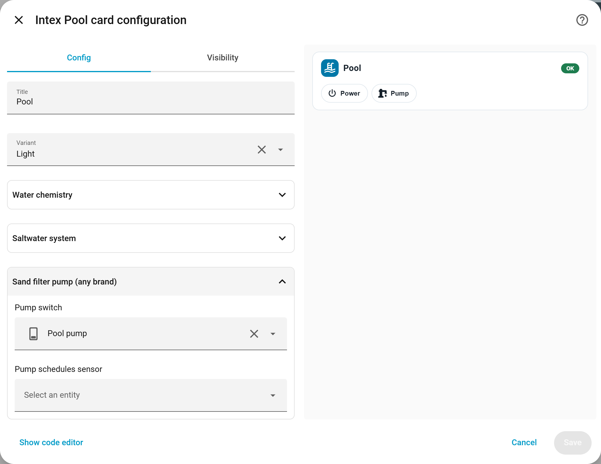
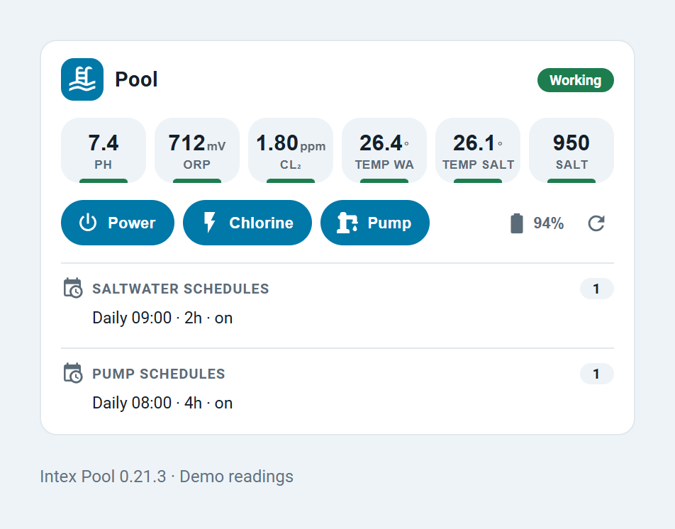
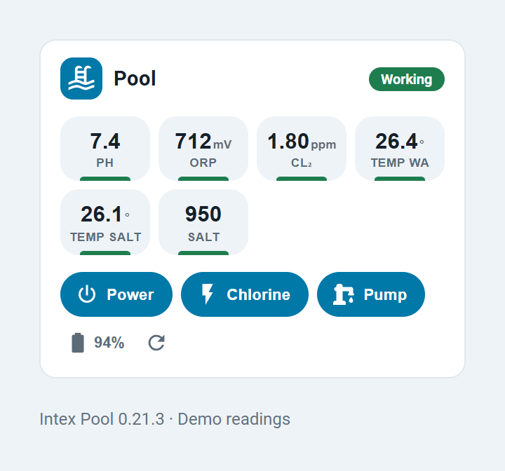

# Dashboard guide

[Overview](../README.md) · [Installation](installation.md) · [Features](features.md) · [Troubleshooting](troubleshooting.md)

The card is bundled with Intex Pool and uses `type: custom:intex-pool-card`.
The integration must be configured and loaded before its card can be added.
Everything in this guide applies to v0.21.3; example entity IDs must be replaced
with the IDs from your own Home Assistant installation.

## Add and edit the card

1. Open a dashboard you can customize, enter edit mode and select **Add card**.
2. Search for **Intex Pool** and open its visual editor.
3. Set the title and variant, then expand **Water chemistry**, **Saltwater system**
   or **Sand filter pump (any brand)** to check the detected entities.
4. Select the entities for this pool, clear fields you do not want displayed, and save.
5. Reload the dashboard and confirm the same selections are still used.



The editor above is from HA 2026.9.1 with the v0.21.3 card and test switches.

Auto-detection reads the integration's entity registry and linked-pump selector;
it does not require the default device names. With multiple pools, manually choose
the entities for **every role you want on each card** and clear unrelated roles.
There is no single pool/device filter that isolates all auto-detection for you.

### Showing only selected equipment

An omitted option means **allow auto-detection**. An explicit empty string means
**do not use an entity for this role**. The visual editor preserves cleared fields.

```yaml
type: custom:intex-pool-card
title: Garden pool
variant: auto
pump_switch: switch.pool_pump
power_switch: ""         # Hide the saltwater power control
chlorination_switch: ""  # Hide chlorine production control
```

This example overrides three controls; omitted sensor fields can still be detected.
For a strict pump-only card in an installation that also has analyzer/saltwater entities,
clear the unwanted sensor and schedule fields too. Older nested editor configurations
are read by v0.21.3 and saved in the flat format above.

## External pump and saltwater relays

### Link a pump

Follow [existing pump setup](installation.md#b-existing-pump-switch--no-tuya-account-for-this-path)
to configure the integration using your pump's original HA switch. The additional
**Pump switch** entity is a selector that references that switch; it is not a duplicate
hardware switch. The card resolves the selector's current value.

You can override it in **Edit card → Sand filter pump (any brand) → Pump switch**.
Select the original switch, not the selector or the **Pump auto mode** switch.
Changing a card override does not change the backend pump-auto target.

### Add a saltwater relay

For a non-Wi-Fi chlorinator controlled by Shelly or another HA relay:

1. Make sure Intex Pool is already configured. If you have an existing pump switch,
   the linked-pump setup above is a cloud-free way to load the integration.
2. In the card editor, expand **Saltwater system** and choose the relay under **Power switch**.
3. Clear any unrelated saltwater sensor, alarm, schedule or chlorine-production fields.
4. Save and check that the card points to the intended relay.

```yaml
type: custom:intex-pool-card
title: Pool controls
power_switch: switch.saltwater_relay
pump_switch: switch.pool_pump
chlorination_switch: ""
```

This is **manual control of an existing switch**. It adds no saltwater device setup
mode, measurements, Tuya schedules or automatic pump interlock for the relay.
Power being on does not confirm chlorine production or water circulation.
Use **Chlorination switch** only if the chosen entity actually controls production.
See [pump-auto prerequisites](features.md#linked-pump-auto-mode) for the separate automatic mode.

## Read the card

| Item | Meaning |
| --- | --- |
| pH, ORP, Cl₂, temperature and salt tiles | Values from the configured entities; tap for HA's entity details. Cl₂ is the analyzer's reference reading. |
| **Temp WA** / **Temp salt** | Separate analyzer and saltwater temperatures. One unique temperature becomes **Temp**. |
| Power / Chlorine / Pump | Toggle the configured switch. Filled buttons represent `on`; buttons wait for a pending service call. |
| Battery and refresh icon | Open battery details or request a measurement, if those entities are available. |
| Age badge | Appears when the configured **Last measurement** timestamp is at least three hours old. |
| Status badge | Saltwater alarm/status when configured; **Offline** if that status is unavailable. Without those entities, **OK** is a generic fallback, not a physical health check. |
| Schedule rows | Read-only summary from the configured schedule sensors. Tap the section for entity details; edit schedules through device entities. |

Unavailable controls/readings may disappear. Start with the source entity's state
when something is missing; the card cannot repair an offline device.



## Appearance and mobile layouts

`variant: auto` follows your Home Assistant theme. `light`, `dark`, `ocean` and
`midnight` choose a fixed palette without changing the rest of your dashboard.


The header and metric tiles wrap to fit narrow cards. Sections uses content height,
and Masonry reports the measured card height. Avoid forcing a fixed row count on a
card with a long schedule list. A full-width card is easier to read on a phone than
several compact cards placed side by side.



## Dashboard layouts and YAML examples

The examples below are **view entries** in a dashboard's `views:` list. In the
individual card editor, paste only the `type: custom:intex-pool-card` block.
Add to your existing configuration; do not replace your whole dashboard.

### Sections

```yaml
title: Pool
path: pool
type: sections
sections:
  - type: grid
    cards:
      - type: custom:intex-pool-card
        title: Pool
        variant: auto
```

### Masonry, Sidebar or Panel

```yaml
title: Pool
path: pool
type: masonry
cards:
  - type: custom:intex-pool-card
    title: Pool
```

Use `type: sidebar` for Sidebar or `type: panel` for Panel. A Panel view contains
one top-level card; use a stack if you need several cards inside that single panel.

### Inside another card

This is a card block that can be added to a view:

```yaml
type: vertical-stack
cards:
  - type: custom:intex-pool-card
    title: Pool
  - type: entities
    entities:
      - switch.pool_pump
```

The four native view types were checked in both YAML and UI-managed dashboards.
Vertical/horizontal stacks, grid, conditional cards and subviews were additionally
checked in the YAML dashboard. Energy and other dedicated pages are not arbitrary
custom-card containers. Third-party layouts
and mobile app WebViews require their own verification; see the
[tested matrix](github-issues-2026-09-10.md#tested-home-assistant-and-browser-matrix).

## Card configuration reference

All entity options are optional. Omit to allow detection; use `""` to suppress a role.
The visual editor filters its sensor/button pickers to Intex Pool entities. Switch
pickers accept any HA switch. Advanced YAML overrides are read directly by the card.

| Option | Value / purpose |
| --- | --- |
| `type` | Required: `custom:intex-pool-card` |
| `title` | Text; defaults to `Pool` |
| `variant` | `auto`, `light`, `dark`, `ocean`, `midnight` |
| `ph_sensor`, `orp_sensor`, `fc_sensor` | Chemistry sensor entity IDs |
| `sensor_temp`, `salt_temp` | Analyzer and saltwater temperature entity IDs |
| `battery`, `refresh_button` | Analyzer battery sensor and refresh button |
| `orp_trend`, `last_measurement` | ORP trend sensor and measurement timestamp sensor |
| `ph_indicator`, `orp_indicator` | Advanced YAML/detected color-indicator entities; valid device indicators override numeric color heuristics |
| `power_switch`, `chlorination_switch` | Saltwater power and actual production switches |
| `salinity`, `salt_status`, `salt_alarm` | Saltwater readings/status/alarm entities |
| `pump_switch` | The actual switch to toggle for the pump |
| `schedules_sensor` | Saltwater schedule summary sensor |
| `pump_schedules_sensor` | Pump schedule summary sensor |

Pump power and energy sensors can be linked in **integration setup/options**; they
are not card configuration fields and are not displayed as dedicated card tiles.
HA-owned layout keys, such as `grid_options`, remain dashboard settings.

## Card not found or custom element doesn't exist

1. Check that the **Intex Pool integration is configured and loaded** under Devices & services.
2. After installation/update, restart HA and fully reload the browser or app.
3. Open `/intex_pool/intex-pool-card.js` on your HA host. It must return JavaScript,
   not a missing-file page. A 404 points to integration loading; a resource entry alone cannot fix it.
4. If the file is served but automatic registration is still missing, add the manual
   module resource below and reload again.

For UI-managed resources, open **Settings → Dashboards → menu (⋮) → Resources → Add resource**:

| Field | Value |
| --- | --- |
| URL | `/intex_pool/intex-pool-card.js` |
| Resource type | **JavaScript module** |

If your installation explicitly manages Lovelace resources in YAML, add the following
under the existing `lovelace:` section of `configuration.yaml` instead:

```yaml
lovelace:
  resource_mode: yaml
  resources:
    - url: /intex_pool/intex-pool-card.js
      type: module
```

The way resources are stored is separate from whether an individual dashboard uses
YAML. Do not switch resource storage modes just to add the card. Reload the resources
using HA's dashboard menu after editing them, then reload the browser.
Automatic and manual registration together produce one card-picker entry in v0.21.3.

Official background: [HA custom-card resources](https://developers.home-assistant.io/docs/frontend/custom-ui/registering-resources/)
and [dashboard configuration](https://www.home-assistant.io/dashboards/dashboards/).
