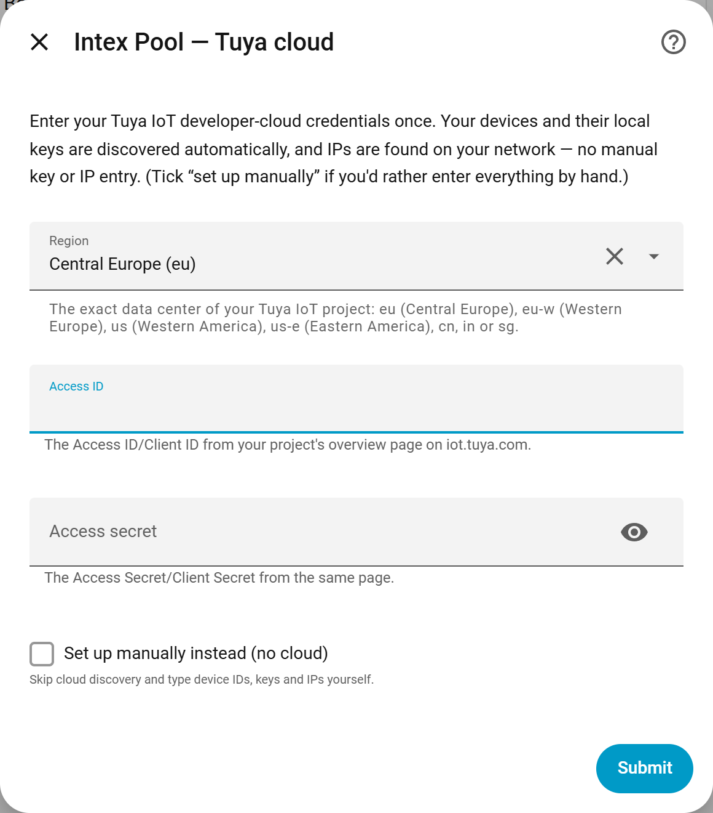
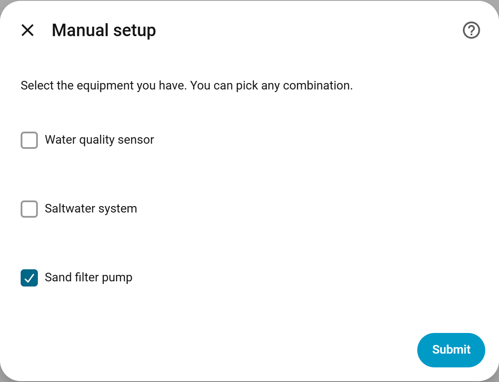
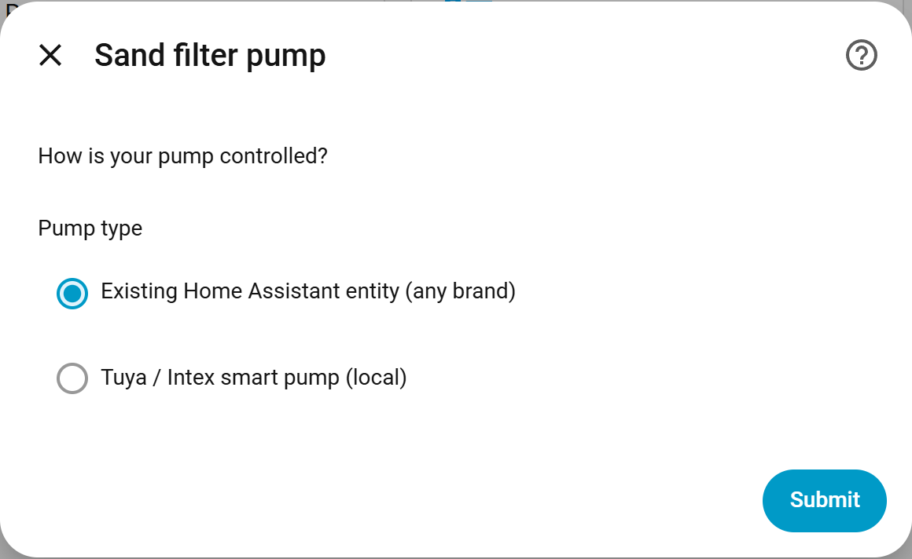
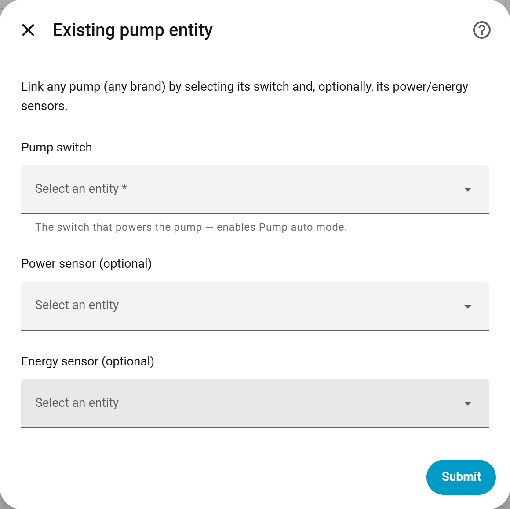

# Installation and first-run checks

[Overview](../README.md) · [Tuya setup](tuya-setup.md) · [Dashboard guide](dashboard.md) · [Troubleshooting](troubleshooting.md)

Intex Pool is a **custom integration** that includes its own dashboard card.
Install the integration once, configure at least one supported device or linked pump,
then add the card to a dashboard.

## Before you begin

| Requirement | Check |
| --- | --- |
| Home Assistant | 2025.8 or newer, as declared in `hacs.json`; the v0.21.3 card was browser-tested on HA 2026.9.1 |
| Administrator access | Needed to install, restart and configure integrations |
| Supported equipment | Check the [compatibility matrix](compatibility.md) |
| HACS, for the recommended path | Follow the [official HACS installation guide](https://www.hacs.xyz/docs/use/download/download/) if it is not installed |
| Connection details | Use the matching setup path below; a linked pump switch does not need Tuya credentials |

## Install through HACS

1. Open the button above. Alternatively, open **HACS → menu → Custom repositories**,
   enter `https://github.com/Hovborg/intex-pool`, choose type **Integration**, and add it.
2. Open **Intex Pool** in HACS and choose **Download**. Use the latest stable release.
3. Restart Home Assistant from **Settings → System → menu (⋮) → Restart Home Assistant**.
4. Open **Settings → Devices & services → Add integration**, search for **Intex Pool**, and choose it.
5. Continue with the setup path matching your equipment below.

The integration is not in HA's built-in integration catalog until its files are
installed and Home Assistant has restarted. The HACS button requires a configured
My Home Assistant address and HACS on that instance; the manual repository entry
above is the fallback.

## Choose the right setup path

### A. Water Analyzer or automatic Tuya discovery

Prepare the developer project using the [Tuya setup guide](tuya-setup.md). You need
its Access ID, Access Secret, exact data center, linked app account and active API access.
The official HA Tuya integration's User Code is not a substitute.

Show the first setup screen

Captured in the isolated test installation. No credentials are shown.

1. On the first Intex Pool screen, enter the cloud project details.
2. Select only the pool devices you actually own. Leave other device fields empty.
3. For a Tuya pump, select its discovered device. For a relay-controlled pump, select its existing HA switch instead.
4. Finish setup. Local devices use their local keys and LAN addresses; the Water Analyzer continues to use cloud access.

LAN discovery may not find devices on another subnet or VLAN. In that case, use
the manual details path with the correct reachable LAN IP. A successful cloud
device listing does not prove that HA can reach the device locally.

### B. Existing pump switch — no Tuya account for this path

First confirm that the switch already controls your pump through its own HA integration.

1. On the first Intex Pool screen, tick **Set up manually instead** and submit.
2. Select **Sand filter pump**. Leave water sensor and saltwater unchecked if absent.
3. Choose **Existing Home Assistant entity** as the pump type.
4. Select the pump's original switch and optional power/energy sensors, then finish.

Intex Pool creates a **Pump switch** selector that points to the switch you chose.
It does not create a second hardware switch. The card resolves that selection automatically.
For a separate saltwater relay, also follow [relay card setup](dashboard.md#external-pump-and-saltwater-relays).

Show the three manual pump setup screens

**Select only the equipment you have.**

**Choose the existing-entity connection.**

**Select your original pump switch and optional power/energy sensors.**

These are the actual v0.21.3 forms in HA 2026.9.1, captured before submitting the device setup.

### C. Manual local Tuya pump or saltwater system

Use this path when you already have the device ID, current local key and LAN IP.
It skips cloud discovery; it does not obtain those details for you.

1. Tick **Set up manually instead**, then select the equipment you want to configure.
2. Enter each local device's ID, local key and reachable private LAN IP.
3. Leave protocol on **auto**, or choose the known version reported for that device.
4. Complete setup, then check the device entities.

Local control can run without ongoing cloud access. Device schedules still need cloud
credentials. A manually configured **Water Analyzer remains cloud-based**, despite the
first screen's “no cloud” wording. See [local connection details](tuya-setup.md#local-saltwater-system--tuya-pump).

## Add the dashboard card

1. Fully reload the browser tab, or close and reopen the Companion App.
2. Open a dashboard you can customize, enter edit mode and choose **Add card**.
3. Search for **Intex Pool**, check the detected entities and save.

The card is served by the loaded integration at `/intex_pool/intex-pool-card.js`.
No separate Lovelace repository is required. If the card is missing, use the
[resource troubleshooting steps](dashboard.md#card-not-found-or-custom-element-doesnt-exist).

## Confirm the first installation

| Check | What a successful check establishes |
| --- | --- |
| Intex Pool appears under Devices & services without a setup error | The integration loaded |
| Your selected devices and expected entities appear | The configuration created the right entities |
| The linked pump selector points to the original switch | The integration references your intended pump |
| The dashboard shows those same entities after save/reload | The card configuration is being used |
| Values update, and an intended control is confirmed on the equipment | The device connection works beyond configuration alone |

A green card status is not proof of water quality or of physical water circulation.
For a sleeping analyzer, check **Last measurement**; reloading the dashboard does not
request a fresh sample. See [measurement refresh](tuya-setup.md#refreshing-measurements).

## Manual installation without HACS

1. Download the source ZIP from the [latest stable release](https://github.com/Hovborg/intex-pool/releases/latest) and extract it.
2. Copy **only** `custom_components/intex_pool` into your HA configuration directory,
   so the final path is `<config>/custom_components/intex_pool/manifest.json`.
3. Keep the entire `intex_pool` folder, including `frontend`, `brand` and `translations`.
   Do not put the outer repository folder inside `custom_components`.
4. Restart Home Assistant, then add the integration and card as described above.

`<config>` means the directory containing your HA `configuration.yaml`; its host path
depends on your HA installation. With manual installation, HACS does not manage updates.
Use the full integration folder from a release when updating it.

## Update an existing installation

1. Read the [release notes](../CHANGELOG.md) and use your normal HA backup procedure.
2. Download the update in HACS, or replace the integration files if installed manually.
3. Restart Home Assistant.
4. Fully reload the browser and each Companion App session that displays the card.
5. Check the integration status, current measurements and your saved dashboard selections.

v0.21.3 reads the older nested card-editor configuration and preserves explicit
selections. Recreating the integration is not required for the card fixes. If you
replace physical equipment instead, follow [reconfiguration](troubleshooting.md#changed-keys-or-replacement-equipment).

## Remove Intex Pool

Delete the relevant entry under **Settings → Devices & services → Intex Pool**.
Then remove the HACS download, or the manually installed integration folder, and
restart Home Assistant. Remove cards or automations that referenced the deleted entities.
If you added a manual dashboard resource, remove it too.

Removing the integration does not undo schedules previously written to the device/cloud.
Check those in the device's controlling app if you want to change them.
